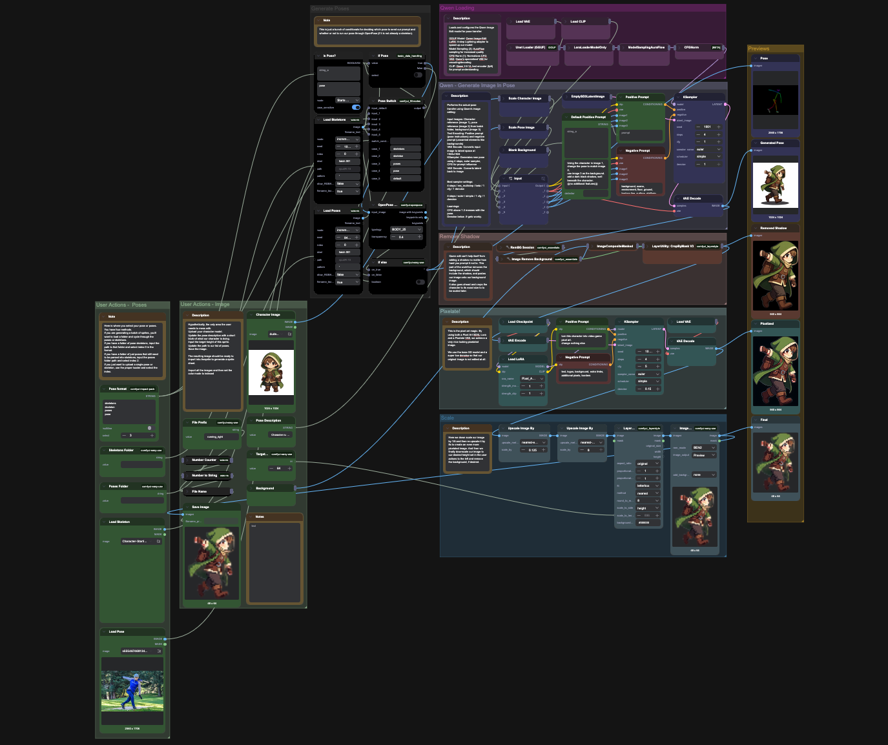

# ComfyUI Sprite Generator

A ComfyUI workflow for generating pixel art sprites from character images and pose references.

## What It Does

Takes a character image + pose/skeleton reference and generates a pixel art sprite of that character in the new pose. Useful for creating sprite sheet animations.

## Setup

1. Install [ComfyUI](https://github.com/comfyanonymous/ComfyUI)
2. Install [ComfyUI-Manager](https://github.com/Comfy-Org/ComfyUI-Manager)
3. Load `sprite-generator.json` in ComfyUI
4. Click **Manager → Install Missing Custom Nodes**
5. Restart ComfyUI
6. Download the required models (see below)

## Required Models

| Model                                          | Path                       | Download                                                                                                                |
| ---------------------------------------------- | -------------------------- | ----------------------------------------------------------------------------------------------------------------------- |
| `Qwen-Image-Edit-2509-Q3_K_M.gguf`             | `models/diffusion_models/` | [HuggingFace](https://huggingface.co/QuantStack/Qwen-Image-Edit-2509-GGUF/tree/main)                                    |
| `Qwen-Image-Lightning-4steps-V1.0.safetensors` | `models/loras/`            | [HuggingFace](https://huggingface.co/lightx2v/Qwen-Image-Lightning/tree/main)                                           |
| `qwen_image_vae.safetensors`                   | `models/vae/`              | [HuggingFace](https://huggingface.co/QuantStack/Qwen-Image-Edit-GGUF/tree/5cf642dd2b94af2a558ec06a9dde255c673e1fdf/VAE) |
| `qwen_2.5_vl_7b_fp8_scaled.safetensors`        | `models/text_encoders/`    | [HuggingFace](https://huggingface.co/Comfy-Org/Qwen-Image_ComfyUI/tree/main/split_files/text_encoders)                  |
| ` sd_xl_base_1.0_0.9vae.safetensors`           | `models/checkpoints/`      | [HuggingFace](https://huggingface.co/stabilityai/stable-diffusion-xl-base-1.0/tree/main)                                |
| `Pixel_Art_SDXL.safetensors`                   | `models/loras/`            | [CivitAI](https://civitai.com/models/1994051)                                                                           |
| `pixelateX8VAEForSDXL_v10.safetensors`         | `models/vae/`              | [CivitAI](https://civitai.com/models/1492329/pixelate-x8-vae-for-sdxlponyillustrious)                                   |

## Usage

You should only really need to mess with the left (green) side of the workflow. Outside of those controls, you may find some success with tweaking the first sampler or the prompts.

1. **Character Image**: Upload the character you want to sprite-ify. Preferably on an empty white canvas. 1024x1024 pixels
2. **Pose Input**: Either:
   - Upload individual pose/skeleton images, or
   - Point to a folder of poses for batch processing
3. **Background**: Upload a background image (or just a white 1024x1024 image)
4. **Pose Description**: Describe the pose/animation (e.g., "Character running animation frame, moving to the right")
5. **Target Height**: Set output sprite height in pixels (default: 64px)
6. **File Prefix**: Set the output filename prefix

Run the workflow. Output sprites are saved to `output/`.

## Workflow Overview

1. **Qwen Image Edit** - Transfers the pose onto your character while preserving their design
2. **Shadow Removal** - Cleans up background artifacts from generation
3. **Pixelation** - Applies pixel art style via LoRA + specialized VAE
4. **Scaling** - Downscale/upscale for authentic pixel art look at target resolution

## Skeleton Resources

- [OpenPoses](https://openposes.com/) - Collection of various skeleton poses
- [Running/Walking Skeletons](https://civitai.com/models/56307?modelVersionId=63973) - Pre-made running and walking animation skeletons

## Post-Processing

Output sprites are ready to import into [Aseprite](https://www.aseprite.org/) for cleanup. For a more authentic retro feel, convert the sprite's color mode to **Indexed** (Sprite → Color Mode → Indexed).
